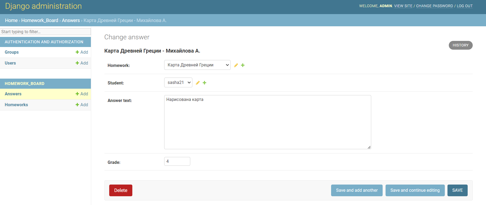

#  Лабораторная работа 2. Реализация простого сайта средствами Django

## Цель лабораторной работы
Овладеть практическими навыками и умениями реализации web-сервисов
средствами Django 2.2.

## Практическое задание
Реализовать сайт используя фреймворк Django 3 и СУБД PostgreSQL, в соответствии с вариантом задания лабораторной работы.
## Задание в соответствии с вариантом 2
О домашнем задании должна храниться следующая информация: предмет,
преподаватель, дата выдачи, период выполнения, текст задания, информация о штрафах.

Необходимо реализовать следующий функционал

## Реализация функционала

* Регистрация новых пользователей.
* Просмотр домашних заданий по всем дисциплинам (сроки выполнения, описание задания)
* Сдача домашних заданий в текстовом виде.
* Администратор (учитель) должен иметь возможность поставить оценку за задание средствами Django-admin.
* В клиентской части должна формироваться таблица, отображающая оценки всех учеников класса.

## Описание моделей

### Модель Homework

Модель `Homework` представляет собой таблицу, содержащую информацию о домашних заданиях.

#### Поля

- `title` (CharField): Название домашнего задания. Максимальная длина - 100 символов.
- `subject` (CharField): Предмет, к которому относится домашнее задание. Максимальная длина - 100 символов.
- `teacher` (CharField): Имя учителя, выдавшего задание. Максимальная длина - 100 символов.
- `description` (TextField): Описание домашнего задания.
- `due_date` (DateTimeField): Дата и время сдачи домашнего задания.
- `penalty_info` (TextField): Информация о штрафе за опоздание или невыполнение задания.

### Модель Answer

Модель `Answer` представляет собой таблицу, содержащую информацию об ответах студентов на домашние задания.

#### Поля

- `homework` (ForeignKey): Ссылка на домашнее задание, к которому относится ответ.
- `student` (ForeignKey): Ссылка на студента, отправившего ответ.
- `answer_text` (TextField): Текст ответа студента.
- `date_created` (DateTimeField): Дата и время создания ответа.
- `grade` (IntegerField): Оценка, которую выставил учитель за ответ.

## Формы

### Класс `AnswerForm` (Форма ответа)

Класс `AnswerForm` представляет собой форму, связанную с моделью `Answer` для ввода данных ответов студентов на домашние задания.

#### Поля

- `answer_text` (TextField) - Текст ответа студента.
- `homework` (ForeignKey) - Выпадающее меню для выбора домашнего задания, к которому относится ответ.

### Класс `SignUpForm` (Форма регистрации)

Класс `SignUpForm` представляет собой форму регистрации пользователей, основанную на модели `User`.

#### Поля

- `username` (CharField) - Имя пользователя.
- `first_name` (CharField) - Имя пользователя.
- `last_name` (CharField) - Фамилия пользователя.
- `password1` (CharField) - Пароль (поле ввода).
- `password2` (CharField) - Подтверждение пароля (поле ввода).

## Панель администратора
Класс HomeworkAdmin представляет настройки административного интерфейса. Он наследует от admin.ModelAdmin и определяет следующие настройки:
- `list_display` : показывает следующие поля title(название), subject (предмет), teacher(преподаватель) и due_data(дата дедлайна)
Также показывается дата создания для AnswerAdmin.

###URLS
- `admin` - панель администратора
- `student_homework` - домашнее задание со стороны студента-пользователя
- `teacher_answers` - отображение со стороны учителя
- `sign_up` - регистрация пользователя
- `login` - выполняется вход в систему
#### school_homework_board/urls.py
    from django.contrib import admin
    from django.urls import path,include 
    from homework_board.views import student_homework, teacher_answers
    
    urlpatterns = [
        path('admin/', admin.site.urls),
        path('student_homework/', student_homework, name='student_homework'),
        path('teacher_answers/', teacher_answers, name='teacher_answers'),
        path('', include('users.urls'))
    ]
#### user/urls.py
    from django.contrib.auth import views as auth_view
    from django.urls import path
    from .import views
    
    
    urlpatterns = [
        path('sign_up/', views.sign_up, name='users-sign-up'),
        path('login/', auth_view.LoginView.as_view(template_name='login.html'), name='users-login')
    ]

## VIEWS

### student_homework
    def student_homework(request):
        homework = Homework.objects.all()
        if request.method == 'POST':
            form = AnswerForm(request.POST)
            if form.is_valid():
                instance = form.save(commit=False)
                instance.student = request.user
                instance.save()
                return redirect('student_homework')
        else:
            form = AnswerForm()
        return render(request, 'student_homework.html', {'homework': homework, 'form': form})
Описание: Эта функция отображает страницу домашнего задания для учащегося, извлекает все домашние задания из моделей домашних заданий, затем отправляет форму ответа на задание, сохраняет ответ учащегося в базе данных и перенаправляет на страницу домашнего задания учащегося

### teachers_answers
    def teacher_answers(request):
        students = User.objects.filter(is_staff=False)
        grades = {user: Answer.objects.filter(student=user).values_list('grade', flat=True) for user in students}
        return render(request, 'teacher_answers.html', {'students': students, 'grades': grades})
Описание: отображает страницу ответов учащихся преподавателю, фильтрует всех учащихся и получает оценки, полученные каждым учащимся за свои ответы, в форме словаря, а затем передает данные в teacher_answers.html

### sign_up
    def sign_up(request):
        if request.method == 'POST':
            form = SignUpForm(request.POST)
            if form.is_valid():
                form.save()
                return redirect('student_homework')  # Замените 'home' на URL вашей домашней страницы
        else:
            form = SignUpForm()
        return render(request, 'sign_up.html', {'form': form})

Описание: обрабатывает запрос на регистрацию пользователя, проверяет введенные данные формы, сохраняет пользователя в базе данных и перенаправляет на страницу домашнего задания ученика.
## Вывод
В рамках данной лабораторной работы были получены навыки по реализации простого сайта средствами Django. Был получен опыт по реализации web-сервисов для сдачи домашних заданий.

