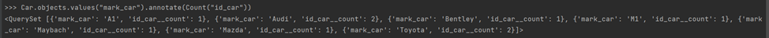

# Практическая работа 3.1
##Задание 1
Описание: напишите запрос на создание 6-7 новых автовладельцев и 5-6 автомобилей, каждому автовладельцу назначьте удостоверение и от 1 до 3 автомобилей. Задание можете выполнить либо в интерактивном режиме интерпретатора, либо в отдельном python-файле. Результатом должны стать запросы и отображение созданных объектов.

###Листинг кода

#### models.py - модель базы данных
    class Car_owner(AbstractUser):
        id_owner = models.IntegerField(primary_key=True)
        birth_day = models.DateField(null=True)
        passport = models.IntegerField(null=True)
        address = models.CharField(max_length=50, null=True, blank=True)
        nationality = models.CharField(max_length=20, null=True, blank=True)
    
        def __str__(self):
            return self.username
    
    
    class Car(models.Model):
        id_car = models.IntegerField(primary_key=True)
        state_number = models.CharField(max_length=15, null=False)
        mark_car = models.CharField(max_length=20, null=False)
        model_car = models.CharField(max_length=20, null=False)
        color = models.CharField(max_length=30, null=True)
        car_owner = models.ManyToManyField(Car_owner, through='Ownership')
    
        def __str__(self):
            return self.state_number
    
    
    class Ownership(models.Model):
        id_owner = models.ForeignKey(Car_owner, on_delete=models.CASCADE, related_name="ownerships")
        id_car = models.ForeignKey(Car, on_delete=models.CASCADE, related_name="ownerships")
        start_date = models.DateField()
        end_date = models.DateField(null=True)
    
    
    class Driver_license(models.Model):
        id_owner = models.ForeignKey(Car_owner, on_delete=models.CASCADE, related_name='licenses')
        license_number = models.CharField(max_length=10, null=False)
        type = models.CharField(max_length=10, null=False)
        date_of_license = models.DateField()

###Выполнение
Создание автомобиля

Создание владельца автомобиля и создание связи между автомобилем и владельцем

Создание остальных автовладельцев, машин и водительских удостоверений

##Задание 2.1
Выведете все машины марки “Toyota” (или любой другой марки, которая у вас есть)
###Выполнение

##Задание 2.2
Найти всех водителей с именем Maria
###Выполнение

##Задание 2.3
Взяв любого случайного владельца получить его id, и по этому id получить экземпляр удостоверения в виде объекта модели (можно в 2 запроса)
###Выполнение

##Задание 2.4
Вывести всех владельцев красных машин
###Выполнение

##Задание 2.5
Найти всех владельцев, чей год владения машиной начинается с 2010 
###Выполнение

##Задание 3.1
Вывод даты выдачи самого старшего водительского удостоверения
###Выполнение

##Задание 3.2
Укажите самую позднюю дату владения машиной, имеющую какую-то из существующих моделей в вашей базе
###Выполнение

##Задание 3.3
Выведите количество машин для каждого водителя
###Выполнение

##Задание 3.4
Подсчитайте количество машин каждой марки
###Выполнение

##Задание 3.5
Отсортируйте всех автовладельцев по дате выдачи удостоверения 
###Выполнение

# Лабораторная работа 3

## Цель лабораторной работы
Овладеть практическими навыками и умениями реализации web-сервисов
средствами Django.

##Практическое задание
Реализовать сайт, используя фреймворк Django 3, Django REST Framework, Djoser и
СУБД PostgreSQL *, в соответствии с вариантом задания лабораторной работы.

##Описание работы (вариант 2)
Создать программную систему, предназначенную для работников библиотеки. Такая система должна обеспечивать хранение сведений об имеющихся в библиотеке книгах, о читателях библиотеки и читальных залах.

Для каждой книги в БД должны храниться следующие сведения: название книги, автор (ы), издательство, год издания, раздел, число экземпляров этой книги в каждом зале библиотеки, а также шифр книги и дата закрепления книги за читателем. Книги могут перерегистрироваться в другом зале.

Сведения о читателях библиотеки должны включать номер читательского билета, ФИО читателя, номер паспорта, дату рождения, адрес, номер телефона, образование, наличие ученой степени.

Читатели закрепляются за определенным залом, могут переписаться в другой зал и могут записываться и выписываться из библиотеки.

Библиотека имеет несколько читальных залов, которые характеризуются номером, названием и вместимостью, то есть количеством людей, которые могут одновременно работать в зале.

Библиотека может получать новые книги и списывать старые. Шифр книги может измениться в результате переклассификации, а номер читательского билета в результате перерегистрации.

## Реализация функционала
- Записать в библиотеку нового читателя.
- Исключить из списка читателей людей, записавшихся в библиотеку более года
назад и не прошедших перерегистрацию.
- Списать старую или потерянную книгу.
- Принять книгу в фонд библиотеки.

#### models.py
    class User(AbstractUser):
        REQUIRED_FIELDS = ['first_name', 'last_name']
    
        def __str__(self):
            return self.username
    
    
    class BookInstance(models.Model):
        section = models.CharField(max_length=20, verbose_name='Секция')
        code = models.CharField(max_length=20, verbose_name='Артикул экземпляра')
        year = models.IntegerField(verbose_name='Год издания')
        conditions = (
            ('a', 'высокое'),
            ('b', 'среднее'),
            ('с', 'низкое'),
        )
        condition = models.CharField(max_length=1, choices=conditions, verbose_name='Состояние экземпляра')
        book = models.ForeignKey('Book', verbose_name='Книга', on_delete=CASCADE,related_name='book_instances' )
        reader = models.ForeignKey('Reader', on_delete=models.SET_NULL, null=True,
                                   related_name='book_instances', verbose_name='Читатель', blank=True)
        room = models.ForeignKey('Room', related_name='book_instances', verbose_name='Зал',
                                 on_delete=CASCADE, null=True, blank=True)
        date_issue = models.DateTimeField(verbose_name='Последняя дата выдачи', blank=True, null=True)
    
        def __str__(self):
            return self.code
    
    
    class Book(models.Model):
        name = models.CharField(max_length=50, verbose_name='Название')
        author = models.CharField(max_length=70, verbose_name="Автор(ы)")
        publisher = models.CharField(max_length=30, verbose_name='Издательство')
    
        def __str__(self):
            return self.name
    
    
    class Reader(models.Model):
        ticket = models.CharField(max_length=20, verbose_name='Номер билета читателя')
        name = models.CharField(max_length=70, verbose_name="ФИО")
        passport = models.CharField(max_length=20, verbose_name='Номер паспорта')
        birth_date = models.DateField(verbose_name='Дата рождения')
        address = models.CharField(max_length=100, verbose_name='Адрес')
        phone_number = models.CharField(max_length=20, verbose_name='Номер телефона')
        educations = (
            ('н', 'начальное'),
            ('с', 'среднее'),
            ('в', 'высшее'),
        )
        education = models.CharField(max_length=1, choices=educations, verbose_name='Образование')
        degree = models.BooleanField(default=False, verbose_name='Наличие ученой степени')
        registration_date = models.DateField(verbose_name='Дата регистрации')
        room = models.ForeignKey('Room', related_name='readers', verbose_name='Зал, за которым закреплен читатель',
                                 on_delete=CASCADE, null=True)
    
        def __str__(self):
            return self.name
    
    
    
    class Room(models.Model):
        name = models.CharField(max_length=20, verbose_name='Название')
        capacity = models.IntegerField(verbose_name='Вместимость')
    
        def __str__(self):
            return self.name

#### views.py

    from django.db.models.query import QuerySet
    from django.shortcuts import render
    from rest_framework.response import Response
    from rest_framework.views import APIView
    
    from .models import *
    from .serializers import *
    from rest_framework.generics import CreateAPIView, ListAPIView, RetrieveUpdateDestroyAPIView
    from rest_framework.permissions import IsAuthenticated
    
    
    # просмотр информации о читателях
    class ReaderListAPIView(ListAPIView):
        serializer_class = ReaderSerializer
        queryset = Reader.objects.all()
    
    
    # создание читателя
    class CreateReaderAPIView(CreateAPIView):
        permission_classes = [IsAuthenticated]
        serializer_class = ReaderSerializer
        queryset = Reader.objects.all()
    
    
    # просмотр всех произведений в библиотеке
    class BookListAPIView(ListAPIView):
        serializer_class = BookSerializer
        queryset = Book.objects.all()
    
    
    # появление нового произведения в библиотеке
    class CreateBookAPIView(CreateAPIView):
        permission_classes = [IsAuthenticated]
        serializer_class = BookSerializer
        queryset = Book.objects.all()
    
    
    # просмотр экземпляров произведений
    class BookInstanceAPIView(ListAPIView):
        serializer_class = BookInstanceSerializer
        queryset = BookInstance.objects.all()
    
    # появление нового экземпляра произведения в библиотеке
    class CreateInstanceAPIView(CreateAPIView):
        permission_classes = [IsAuthenticated]
        serializer_class = BookInstanceSerializer
        queryset = BookInstance.objects.all()
    
    
    # редактирование и удаление произведений
    class OneBookAPIView(RetrieveUpdateDestroyAPIView):
        permission_classes = [IsAuthenticated]
        serializer_class = BookSerializer
        queryset = Book.objects.all()
    
    
    # редактирование и удаление экземпляров
    class OneInstanceAPIView(RetrieveUpdateDestroyAPIView):
        permission_classes = [IsAuthenticated]
        serializer_class = BookInstanceSerializer
        queryset = BookInstance.objects.all()
    
    
    # редактирование и удаление читателей
    class ReaderDetailAPIView(RetrieveUpdateDestroyAPIView):
        permission_classes = [IsAuthenticated]
        serializer_class = ReaderSerializer
        queryset = Reader.objects.all()
    
    #просмотр всех читательских залов библиотеки
    class RoomListAPIView(ListAPIView):
        serializer_class = RoomSerializer
        queryset = Room.objects.all()
    
    
##Вывод
В рамках данной лабораторной работы были получены навыки по реализации простого сайта средствами Django. Был получен опыт по реализации web-сервисов библиотеки.

