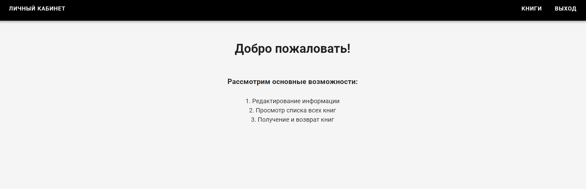
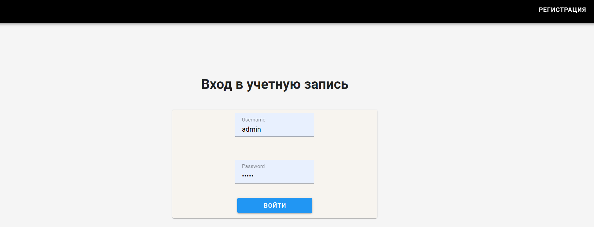
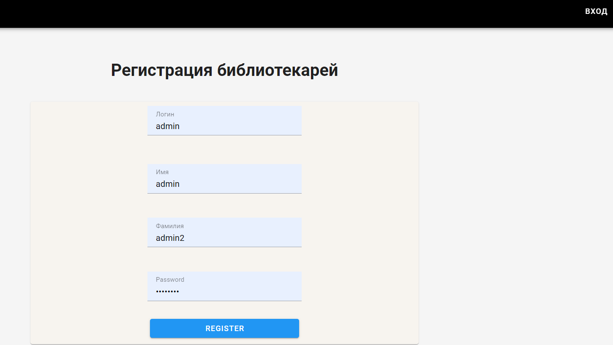
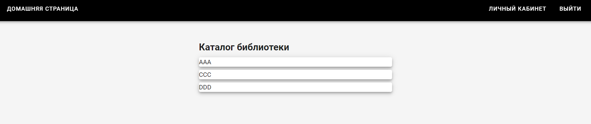
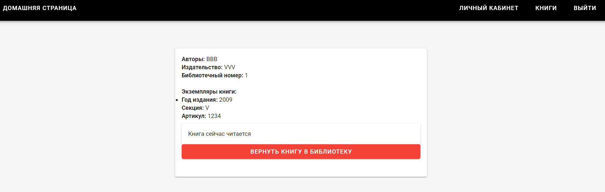
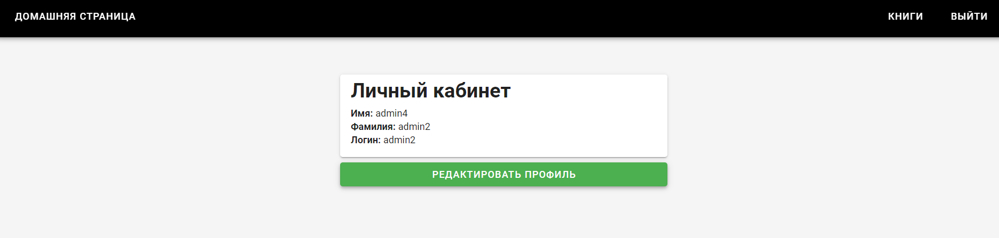
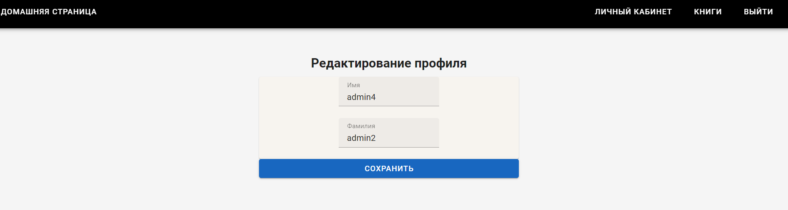

# Лабораторная работа 4
## Цель лабораторной работы
Овладеть практическими навыками и умениями реализации клиентской части приложения средствами vue.js.
##Практическое задание и порядок выполнения работы
- Реализовать интерфейсы авторизации, регистрации и изменения учётных данных и настроить взаимодействие с серверной частью
- Реализовать клиентские интерфейсы и настроить взаимодействие с серверной частью
- Подключить vuetify или аналогичную библиотеку
##Описание работы (вариант 2)
Создать программную систему, предназначенную для работников библиотеки. Такая система должна обеспечивать хранение сведений об имеющихся в библиотеке книгах, о читателях библиотеки и читальных залах.

Для каждой книги в БД должны храниться следующие сведения: название книги, автор (ы), издательство, год издания, раздел, число экземпляров этой книги в каждом зале библиотеки, а также шифр книги и дата закрепления книги за читателем. Книги могут перерегистрироваться в другом зале.

## Реализация функционала
- Регистрация и авторизация от имени библиотекаря.
- Изменение данных (ФИО) библиотекаря.
- Просмотр всех книг.
- Просмотр всех экземпляров книг
- Закрепление книги за читателем.
- Открепление книги от читателя.

#### Homeview.vue
    <template>
      <v-app>
        <bar-layout>
          <v-btn v-if="auth" @click="LK()"
                 text
          > Личный кабинет
          </v-btn>
          <v-spacer></v-spacer>
          <v-btn v-if="auth" @click="Books()"
                 text
          > Книги
          </v-btn>
          <v-btn v-if="auth" @click="goLogout()"
                 text
          > Выход
          </v-btn>
        </bar-layout>
        <v-main class="vh-100" style="background-color: hsl(0, 0%, 96%);">
            
          <HomePage/>
        </v-main>
      </v-app>
    </template>
    
    

Рассмотрим реализацию выполнения главной страницы. Моно увидеть возможность перехода в личный кабинет и книги, а также можно выйти со страницы.

#### Loginview.vue
    <template>
        <v-app>
          <bar-layout>
              <LoginBar />
            </bar-layout>
            <v-main class = "vh-100" style = "background-color: hsl(0, 0%, 96%);">
                 
            <h1 style="text-align: center;" > Вход в учетную запись  </h1>
             
            <v-col cols="4" class="mx-auto">
            <v-card max-width = 600 color = "#f7f4ef">
              <v-row class = "py-2">
                <v-col cols="5" class="mx-auto">
                  <v-text-field
                    label="Username"
                    v-model="username"
                    name="username"
                    placeholder="username"
                  />
                </v-col>
                </v-row>
              <v-row>
                <v-col cols="5" class="mx-auto">
                  <v-text-field
                    label="Password"
                    v-model="password"
                    name="password"
                    type = password
                  />
                </v-col>
              </v-row>
              <v-col cols="5" class="mx-auto">
              <v-btn block color = "blue" @click.prevent = "login()"> Войти </v-btn>
              </v-col>
            </v-card>
          </v-col>
            </v-main>
            </v-app>
      </template>
      
      
Рассмотрим реализацию входа в учетную запись.

#### Registrationview.vue
    <template>
      <v-app>
        <bar-layout>
          <RegistrationBar/>
        </bar-layout>
        <main class="vh-100" style="background-color: hsl(0, 0%, 96%);">
               
          <h1 style="text-align: center;"> Регистрация библиотекарей </h1>
           
          <v-col cols="6" class="mx-auto">
            <v-card max-width=800 color="#f7f4ef">
              <v-row class="py-2">
                <v-col cols="5" class="mx-auto">
                  <v-text-field
                    label="Логин"
                    v-model="signUpForm.username"
                    name="username"
                    placeholder="maria211"
                  />
                </v-col>
              </v-row>
              <v-row>
                <v-col cols="5" class="mx-auto">
                  <v-text-field
                    label="Имя"
                    v-model="signUpForm.first_name"
                    name="first_name"
                    placeholder="Мария"
                  />
                </v-col>
              </v-row>
              <v-row>
                <v-col cols="5" class="mx-auto">
                  <v-text-field
                    label="Фамилия"
                    v-model="signUpForm.last_name"
                    name="last_name"
                    placeholder="Антонова"
                  />
                </v-col>
              </v-row>
              <v-row>
                <v-col cols="5" class="mx-auto">
                  <v-text-field
                    label="Password"
                    v-model="signUpForm.password"
                    name="password"
                    type=password
                  />
                </v-col>
              </v-row>
              <v-col cols="5" class="mx-auto">
                <v-btn block color="blue" @click.prevent="register()"> Register</v-btn>
              </v-col>
            </v-card>
          </v-col>
        </main>
      </v-app>
    </template>
    
    
Рассмотрим реализацию регистрации библиотекарей.

#### Booksview.vue
    <template>
      <section>
        <v-app>
          <bar-layout>
            <AllBooks/>
          </bar-layout>
          <v-main class="vh-100" style="background-color: hsl(0, 0%, 96%);">
            <v-row class="mx-3.5">
              <v-col cols="4" class="mx-auto">
                  
                

                  <h2>Каталог библиотеки</h2>
                  <v-card elevation="5"
                          outlined
                          class="my-2"
                          v-for="book in books" v-bind:key="book" v-bind:book="book">
                    <a @click.prevent="goBook(book.id)">{{ book.name }}</a>
                  </v-card>
                

              </v-col>
            </v-row>
          </v-main>
        </v-app>
      </section>
    </template>
    
    
Рассмотрим реализацию страницы списка книг.

####Bookview.vue
    <template>
      <section>
        <v-app>
          <bar-layout>
            <OneBook/>
          </bar-layout>
          <v-main class="vh-100" style="background-color: hsl(0, 0%, 96%);">
            <v-row class="mx-3.5">
              <v-col cols="5" class="mx-auto">
                  
                

                  <v-card
                    v-if="book"
                    elevation="2"
                    outlined
                    class="my-5"
                  >
                    <v-card-title>
                      <h2>{{ this.book.title }}</h2>
                    </v-card-title>
    
                    <v-card-text>
                      

                        <b>Авторы:</b> {{ this.book.author }} 
                        <b>Издательство:</b> {{ this.book.publisher }}  
                        <b>Библиотечный номер:</b> {{ this.book.id }}  
                         
                        <b>Экземпляры книги:</b>
                        <ul>
                          <li v-for="book_instance in this.book.book_instances" v-bind:key="book_instance"
                              v-bind:book_instance="book_instance">
    
                            <b>Год издания:</b> {{ book_instance.year }} 
                            <b>Секция:</b> {{ book_instance.section }} 
                            <b>Артикул:</b> {{ book_instance.code }} 
                            <v-btn v-if="!book_instance.takenId" color="primary" light
                                   @click="onSelectReader(book_instance.id)">Выдать книгу
                            </v-btn>
                            <v-card
                              v-else
                              elevation="2"
                              outlined
                              class="my-2">
                              <v-card-text>
                                
Книга сейчас читается

                              </v-card-text>
                              <v-spacer></v-spacer>
                              <v-btn block color="red" light @click="onReturnBook(book_instance)">Вернуть книгу в библиотеку</v-btn>
                            </v-card>
                             
                          </li>
                        </ul>
                      

                    </v-card-text>
                  </v-card>
    
    
                

              </v-col>
            </v-row>
          </v-main>
        </v-app>
      </section>
      <v-dialog v-if="givingBook" :model-value="true" @close="givingBook = null">
        

          <v-card>
            <v-list density="compact">
              <v-list-subheader>Читатели</v-list-subheader>
              <select v-model="givingBook.reader" style="outline: 1px solid black">
                <option disabled :value="null">Выберите читателя</option>
                <option
                  v-for="r in readers"
                  :key="r.id"
                  :value="r"
                >
                  {{ r.name }}
                </option>
              </select>
            </v-list>
            <v-spacer></v-spacer>
            

              <v-btn color="primary" @click="onGivingBook">Выдать</v-btn>
            

          </v-card>
        

      </v-dialog>
    </template>
    
    
    

Рассмотрим реализацию списка экземпляров книг.

#### ManagerInfoview.vue
    <template>
      <v-app>
        <bar-layout>
          <ManagerInfo/>
        </bar-layout>
        <v-main class="vh-100" style="background-color: hsl(0, 0%, 96%);">
          <v-row class="mx-3.5">
            <v-col cols="4" class="mx-auto">
                
              

                <v-card
                  elevation="2"
                  outlined
                  class="my-2"
                >
                  <v-card-title>
                    <h2>Личный кабинет</h2>
                  </v-card-title>
    
                  <v-card-text>
                    

                      <b>Имя:</b> {{ this.manager.first_name }}  
                      <b>Фамилия:</b> {{ this.manager.last_name }}  
                      <b>Логин:</b> {{ this.manager.username }}  
                    

                  </v-card-text>
                </v-card>
                <v-btn block color="green" light @click.prevent="goEdit">Редактировать профиль</v-btn>
              

            </v-col>
          </v-row>
        </v-main>
      </v-app>
    </template>
    
    
Рассмотрим реализацию страницы данных библиотекаря.

##Вывод
В рамках данной лабораторной работы были получены навыки по реализации клиентской части приложения средствами vue.js. Был получен опыт по реализации клиентской части библиотеки.
