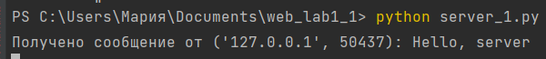
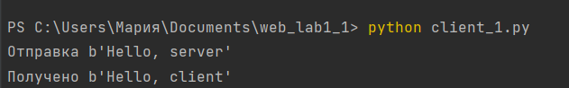
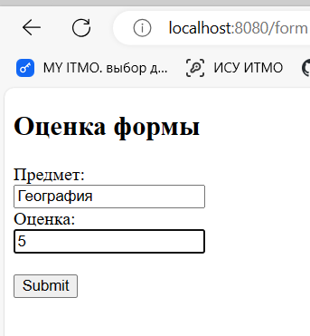

#  Лабораторная работа 1. Работа с сокетами

## Практическое задание 1
Реализовать клиентскую и серверную часть приложения. Клиент отсылает серверу сообщение «Hello, server». Сообщение должно отразиться на стороне сервера. Сервер в ответ отсылает клиенту сообщение «Hello, client». Сообщение должно отобразиться у клиента. Обязательно использовать библиотеку socket. Реализовать с помощью протокола UDP.

### Листинг кода

#### client_1.py

    import socket
    sock = socket.socket(socket.AF_INET, socket.SOCK_DGRAM)
    message = 'Hello, server'.encode()
    server_address = ('localhost', 10000)

    try:
        print('Отправка {!r}'.format(message))
        sent = sock.sendto(message, server_address)
    
        data, server = sock.recvfrom(4096)
        print('Получено {!r}'.format(data))
    
    except Exception as e:
        print(f'Произошла ошибка: {e}')
    
    finally:
        sock.close()

#### server_1.py
    import socket
    
    # UDP
    udp_socket = socket.socket(socket.AF_INET, socket.SOCK_DGRAM)
    message = 'Hello, client'.encode()
    
    server_address = ('localhost', 10000)  #
    udp_socket.bind(server_address)
    
    while True:
        data, address = udp_socket.recvfrom(1024)
        print(f'Получено сообщение от {address}: {data.decode()}')
    
        udp_socket.sendto(message, address)

#### Скриншот работы и выполнения задания 1

## Практическое задание 2

Задание: реализовать клиентскую и серверную часть приложения. Клиент запрашивает у сервера выполнение математической операции, параметры, которые вводятся с клавиатуры. Сервер обрабатывает полученные данные и возвращает результат клиенту.

Варианты:

a. Теорема Пифагора

b. Решение квадратного уравнения.

c. Поиск площади трапеции.

d. Поиск площади параллелограмма.

Мой вариант - b. Решение квадратного уравнения.

### Листинг кода

#### client_2.py
    import socket
    
    while True:
      client_socket = socket.socket(socket.AF_INET, socket.SOCK_STREAM)
      client_socket.connect(('localhost', 12345))
  
    print("(a, b, c):")
    a, b, c = map(float, input().split())
    client_socket.send(f"{a} {b} {c}".encode('utf-8'))
  
    result = client_socket.recv(1024).decode('utf-8')
    print(f"Result: {result}")
  
    client_socket.close()

#### server_2.py
    import socket
    import math
    
    
    def solve_quadratic(a, b, c):
      D = b**2 - 4 * a * c
      if D < 0:
        return "no sols. D<0"
      else:
        sol1 = (-b - math.sqrt(D)) / (2 * a)
        sol2 = (-b + math.sqrt(D)) / (2 * a)
        return sol1, sol2
    
    
    with socket.socket(socket.AF_INET, socket.SOCK_STREAM) as server_socket:
      server_socket.bind(('localhost', 12345))
      server_socket.listen(1)
    
      while True:
        client_socket, addr = server_socket.accept()
        with client_socket:
          print(f"new request: {addr}")
          data = client_socket.recv(1024).decode('utf-8')
          a, b, c = map(float, data.split())
          result = solve_quadratic(a, b, c)
          client_socket.send(str(result).encode('utf-8'))

#### Скриншот работы и выполнения задания 2

## Практическое задание 3
Реализовать серверную часть приложения. Клиент подключается к серверу. В ответ клиент получает http-сообщение, содержащее html-страницу, которую сервер подгружает из файла index.html. Обязательно использовать библиотеку socket. Реализовать с помощью протокола UDP.

### Листинг кода

#### server.py
    import socket
    import threading
    
    def handle_client(client_socket):
        headers = 'HTTP/1.1 200 OK\r\nContent-Type: text/html; charset=utf-8\r\n\r\n'
        with open('index.html', 'r') as f:
            content = f.read()
        client_socket.sendall((headers + content).encode('utf-8'))
        client_socket.close()
    
    def start_server():
        server = socket.socket(socket.AF_INET, socket.SOCK_STREAM)
        host = 'localhost'
        port = 8080
        server.bind((host, port))
        server.listen(4)
        print(f'Started on http://{host}:{port}')
        while True:
            client_socket, address = server.accept()
            data = client_socket.recv(2048).decode('utf-8')
            print(f"-> Подключение от {address}")
            print(f"Запрос:\n{data}")
            client_thread = threading.Thread(target=handle_client, args=(client_socket,))
            client_thread.start()
    
    start_server()

#### index.html
    <!DOCTYPE html>
    <html lang="en">
    <head>
      <meta charset="UTF-8">
      <meta http-equiv="X-UA-Compatible" content="IE=edge">
      <meta name="viewport" content="width=device-width, initial-scale=1.0">
      <title>Server response</title>
    </head>
    <body>
      <h1>
      Hello from server in html
      </h1>
    </body>
    </html>

#### Скриншот работы и выполнения задания 3

## Практическое задание 4

Реализовать двухпользовательский или многопользовательский чат. Реализация многопользовательского часа позволяет получить максимальное количество баллов. Реализовать с помощью протокола TCP. Обязательно использовать библиотеку threading. Для применения с TCP необходимо запускать клиентские подключения И прием и отправку сообщений всем юзерам на сервере в потоках. Не забудьте сохранять юзеров, чтобы потом отправлять им сообщения.

### Листинг кода

#### server.py

    import socket
    import threading
    
    
    def handle_client(conn, addr):
      while True:
        data = conn.recv(1024).decode()
        if not data:
          break
        print(f"User-{addr[1]}: {data}")
        broadcast_message(data, conn)
      conn.close()
      remove_connection(conn)
    
    
    def broadcast_message(message, from_conn):
      for conn in connections:
        if conn != from_conn:
          conn.send(message.encode())
    
    
    def remove_connection(conn):
      connections.remove(conn)
    
    
    def server_program():
      server_socket = socket.socket()
      server_socket.bind((socket.gethostname(), 15000))
      server_socket.listen(5)  # Allow up to 5 connections in the queue
      print("Server started. Waiting for connections...")
    
      while True:
        conn, addr = server_socket.accept()
        print("Connected to:", addr)
        connections.append(conn)
        thread = threading.Thread(target=handle_client, args=(conn, addr))
        thread.start()
    
      server_socket.close()
    
    
    if __name__ == '__main__':
      connections = []
      server_program()

#### client.py

    import socket
    import threading
    
    
    def receive_messages(client_socket):
      while True:
        data = client_socket.recv(1024).decode()
        if not data:
          break
        print(f"Server-{client_socket.getsockname()[1]}: {data}")
    
    
    def client_program():
      host = socket.gethostname()
      port = 15000
      client_socket = socket.socket()
      client_socket.connect((host, port))
      print("Connected to the server.")
    
      receive_thread = threading.Thread(target=receive_messages,
                                        args=(client_socket, ))
      receive_thread.start()
    
      while True:
        message = input(" -> ")
        client_socket.send(message.encode())
        if message.lower().strip() == 'bye':
          break
    
      client_socket.close()
    
    
    if __name__ == '__main__':
      client_program()

#### Скриншот работы и выполнения задания 4

## Практическое задание 5
Необходимо написать простой web-сервер для обработки GET и POST http запросов средствами Python и библиотеки socket. Задание - сделать сервер, который может:
* Принять и записать информацию о дисциплине и оценке по дисциплине.
* Отдать информацию обо всех оценах по дсициплине в виде html-страницы.

### Листинг кода

#### server.py
    import http.server
    import socketserver
    import urllib.parse
    
    class MyHttpRequestHandler(http.server.SimpleHTTPRequestHandler):
        def do_GET(self):
            if self.path == '/':
                self.send_response(200)
                self.send_header("Content-type", "text/html; charset=utf-8")
                self.end_headers()
                with open('data.txt', 'r', encoding='utf-8') as f:
                    data = f.read()
                    html = '''
                    <!DOCTYPE html>
                    <html>
                    <head>
                        <title>Оценки</title>
                    </head>
                    <body>
                        <h2>Оценки</h2>
                        <ul>
                            {}
                        </ul>
                        <a href="/form" style="color: black;">+ Добавить дисциплину</a>
                    </body>
                    </html>
                    '''.format(data)
                    self.wfile.write(bytes(html, 'utf8'))
                print("GET request processed, data sent to client.")
            elif self.path == '/form':
                self.send_response(200)
                self.send_header("Content-type", "text/html; charset=utf-8")
                self.end_headers()
                with open('form.html', 'r', encoding='utf-8') as f:
                    form_data = f.read()
                    self.wfile.write(bytes(form_data, 'utf8'))
                print("GET request for form.html processed, form sent.")
            else:
                self.send_response(404)
                print("GET request for unknown resource, 404 sent.")
    
        def do_POST(self):
            content_length = int(self.headers['Content-Length'])
            post_data = self.rfile.read(content_length)
            post_data = urllib.parse.parse_qs(post_data.decode('utf-8'))
            subject = post_data.get('subject', [''])[0]
            grade = post_data.get('grade', [''])[0]
            with open('data.txt', 'a', encoding='utf-8') as f:
                f.write('<li>' + subject + ' - ' + grade + '</li>\n')
            self.send_response(303)
            self.send_header("Location", "/")
            self.end_headers()
            print("POST request processed, data saved.")
    
    handler_object = MyHttpRequestHandler
    
    PORT = 8080
    my_server = socketserver.TCPServer(("", PORT), handler_object)
    
    print("Server started at http://localhost:" + str(PORT))
    my_server.serve_forever()

#### client.py

    # альтернативный вариант
    import requests
    
    data = {'subject': 'Лин алгебра', 'grade': '5'}
    response = requests.post('http://localhost:8080/', data=data)
    print(response)

#### form.html
    <!DOCTYPE html>
    <html lang="ru">
    <head>
        <meta charset="UTF-8">
        <meta name="viewport" content="width=device-width, initial-scale=1.0">
        <title>Document</title>
    </head>
    <body>
        <h2>Оценка формы</h2>
    
        <form action="http://localhost:8080" method="post">
        <label for="subject">Предмет:</label> 
        <input type="text" id="subject" name="subject"> 
        <label for="grade">Оценка:</label> 
        <input type="text" id="grade" name="grade">  
        <input type="submit" value="Submit">
        </form>
    </body>
    </html>

## Вывод

В рамках данной лабораторной работы были получены навыки по реализации web-серверов и использования сокетов при помощи языка программирования python. Были получены знания по клиент-серверному взаимодействию с помощью протоколов UDP и TCP. Также были систематизированы знания по сетевому взаимодействию, структурами http-запросов и процессами их создания и обработки. Таким образом, данные знания и навыки помогли понять, как происходит сетевое взаимодействие при реализации web-серверов, а также как можно применять полученные знания при создании веб-приложений.
